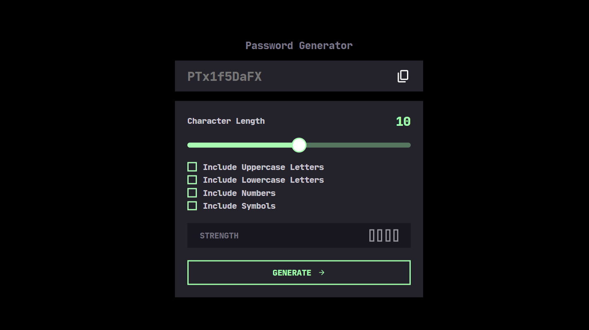

# Password Generator App



## Description

The Password Generator App is a simple web application built using Next.js, Material UI, and Styled Components. It allows users to generate secure and random passwords with various customizable options. This app provides a user-friendly interface and ensures the generation of strong passwords for improved online security.

## Features

- Generate random passwords with customizable options.
- Choose the length of the password.
- Include uppercase letters, lowercase letters, numbers, and special characters in the password.
- Copy generated passwords to the clipboard.
- Responsive design for a seamless experience on different devices.

## Technologies Used

- [Next.js](https://nextjs.org/): A React framework for building server-rendered React applications.
- [Material UI](https://material-ui.com/): A popular React UI framework for designing modern and responsive user interfaces.
- [Styled Components](https://styled-components.com/): A library for styling React components with CSS-in-JS.

## Getting Started

To run the Password Generator App locally, follow these steps:

1. Clone the repository to your local machine:

   ```bash
   git clone https://github.com/yourusername/password-generator-app.git
